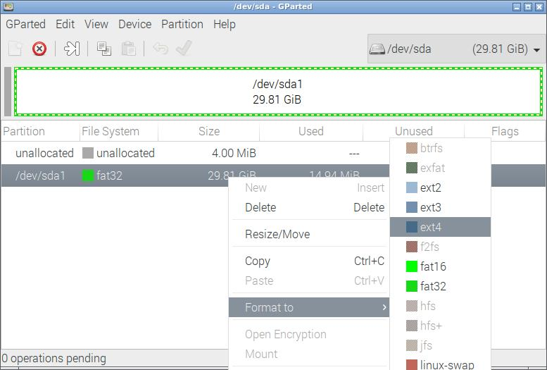
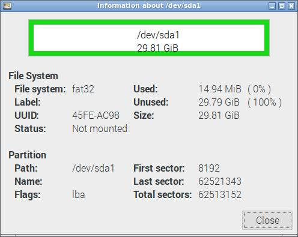

Whereas the [Offical instructions](https://www.raspberrypi.org/documentation/installation/sdxc_formatting.md) tell you to use the *SD Memory Card Formatter* from [sdcard.org](https://www.sdcard.org) these instructions only provide the use of Mac and Windows tools.

So I thought I would document the process of formatting a MicroSD card from the command line.


## Partition Formats
MicroSD cards can be used for many different purposes. Each purpose requires a particular formatting of the card to a particular filesystem format. 

Here are some commonly used file formats in Linux:

	

- **ZFS**  
[ZFS](https://en.wikipedia.org/wiki/ZFS) was designed by Sun Microsystems for [Solaris](https://www.oracle.com/solaris) and is now owned by Oracle. It supports a number of advanced features including drive pooling, snapshots and dynamic disk strping  though many of these features will be brought to Linux by default due to it's inclusion of BtrFS in the Linux Kernel.ZFS checksums each file so it can tell if a file has been corrupted. ZFS is open sourced under the [Sun CDDL license](https://en.wikipedia.org/wiki/Common_Development_and_Distribution_License) which means that it cannot be included in the Linux kernel.
- **BtrFS** or **B-Tree File System*  
 Aka *ButterFS* was originally designed by Oracle and uses a [B-Tree](https://en.wikipedia.org/wiki/B-tree)	 in it's organisation. BtrFS allows for drive pooling and compression that is transparent to the user. In addition, BtrFS can create snapshots and defragment whilst online. 
- **ReiserFS**  
ReiserFS brought a major change to Linux in 2001 when it was introduced. It brought many new features that were technically impossible for EXT-based filesystems. In 2004 **Reiser4** replaced ReiserFS improving on many features that were incomplete in the earlier version. In 2008 the main developer Hans Reiser was []sent to prison](http://www.sfgate.com/bayarea/article/Reiser-confesses-to-strangling-estranged-wife-3197731.php). To date Reiser4 has failed to get into the Linux kernel and it's future looks dim - BtrFS appears to be a better choice for the features. 
- **EXT4**	  
EXT4 has also been designed to be backwards compatible - so much so 	you can mount an EXT" or EXT3 file system as an EXT4. EXT4 includes new features that reduce file fragmentation and so improves performance and delays writes to flash based drives to improve life spans.
- **EXT3**	  
EXT3 is really just EXT2 + Journaling and is backwards compatible with EXT2. EXT2 partitions can be converted to EXT3. It is recommended that you use EXT4 in place of EXT3 as EXT4 has been around since 2008 and has been widely tested.
- **EXT2**	  
EXT2 is not a journaling filesystem but a simple extension of the addressing Terra-byte drives and extended file attributes. The lack of a journal meant it writes less often which makes it good for USB flash drives. FAT32 AND EX-fat are more compatible with other operating systems so it is best to avoid EXT3 unless you need to use it for some particular reason
- **EXT**	  
The *Extended File System* was one of the first filesystems created specifically for Linux and as of to date has had three major revisions (Ext4, Ext3 & Ext2). The EXT filesystem had a number of important features missing and therefore many Linux distributions no longer support it (or limit it's use to read-only).
- **SWAP** can be selected whilst formatting a drive and can be used temporary space by the Linux kernel for virtual memory. For more details on the use of a [SWAP Partition see here](https://www.linux.com/news/all-about-linux-swap-space) 
- **exFAT** and **FAT32** filesystems are from the Windows world and can be employed for easy to/fro migration of data between Windows, Mac and Linux. Out of these two options choose *exFAT* as it supports files over 4GB and partitions over 8TB in size. EXFAT is optimised for Flash based drives including USB drives and SSDs. **NTFS**	really only useful for migrating data from Windows Server machines. for a full discourse on the differences see [here](https://www.geeksforgeeks.org/difference-fat32-exfat-ntfs-file-system/)


## Working out which drive is your MicroSD card

Unlike Windows, most Linux systems does not automatically mount USB keys or SD cards.


To find out which drive you need to format (See also GParted below) choose one of the options below

### If you know the date and time you inserted the device


```
$ sudo ls -ltr / dev/*

... 

lrwxrwxrwx 1 root root  6 Aug  7 15:18 8:0 -> ../sda
lrwxrwxrwx 1 root root  7 Aug  7 15:18 8:1 -> ../sda1

```

At or near the bottom of the list you will see a disk device (named **sda**, sdb, etc) that shows the insert detected time that corresponds to the time you inserted the drive into the machine.


In the example above, the device is **sda** and the first partition on that device is **sda1**

### Or if there is only a few disks on your system

you can also run the **lsblk** to list all [block devices](https://www.linuxjournal.com/article/2890) attached to the system:

```
pi@ian:~ $ lsblk
NAME        MAJ:MIN RM   SIZE RO TYPE MOUNTPOINT
sda           8:0    1  29.8G  0 disk 
└─sda1        8:1    1  29.8G  0 part 
sdb           8:16   1 115.7G  0 disk 
└─sdb1        8:17   1 115.7G  0 part /media/pi/128GB
mmcblk0     179:0    0 119.1G  0 disk 
├─mmcblk0p1 179:1    0   256M  0 part /boot
└─mmcblk0p2 179:2    0 118.8G  0 part /

```

Here we can see three disk devices. The MicroSD card appears as **sda**, a 128gb USB Drive (labelled "128GB") as **sdb** NOTE: the `lsblk` command also shows the drive label as shown on the MOUNTPOINT), and finally **mmcblk0** the boot drive of the Pi as shown by the / and /boot partitions

Make a note of the device. 

## Formatting with GParted

You can format your MicroSD card (or any other drive for that matter) using the GNOME Partition Editor, [GParted](https://gparted.org/). 

GParted allows you to:

- Partition a drive
- Grow or Shrink a partition
- Create space for other filesystems
- Attempt data rescue from lost partitions

Formatting a drive or partition using [GParted](https://gparted.org/) is a simple as right clicking the partition and selecting *Format to* then select the filesystem type.
 



By right clicking and selecting *Information* on the partition you can see which device the MicroSD card is allocated to by the system and other information.



This can also been seen from the GParted menu option.

## Formatting from the command line


Start the partition editor using the drive you saw above (change /dev/sda to your microsd drive):

```
$ sudo parted /dev/sda 
```

Label the drive with  the followign command (this also creates a partition table)

```
(parted)  mklabel msdos
```


Create the partition: 

```
(parted) mkpart primary fat32 1MiB 100%
```


Quit *parted*:

```
(parted) quit
```
	

Then finally format the drive with 
```
$ sudo mkfs.vfat /dev/sda1
```
Replacing mkfs.vfat with one of the following partition formats depending on your choice of formats.

```
mkfs         mkfs.btrfs   mkfs.ext2    mkfs.ext4    mkfs.minix   mkfs.vfat    
mkfs.bfs     mkfs.cramfs  mkfs.ext3    mkfs.fat     mkfs.msdos  
```


For full details on the **parted** command :

```
$ man parted
```

<br>
<br>

# Labelling a drive
### Labelling a disk formatted with EXT4/EXT3/EXT2 filesystem

You can label a drive with an EXT2/3/4 filesystem using the following command

```
$ sudo e2label /dev/sda1 myext4
```

### Labelling a disk formatted with exFAT/FAT32 filesystem

```
$ fatlabel /dev/sda1 myfat32
```

### Labelling a disk formatted with exFAT filesystem

```
$ exfatlabel /dev/sda1 myfat32
```